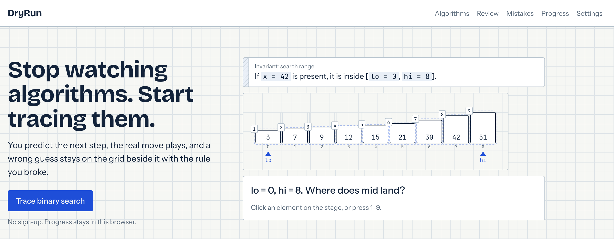
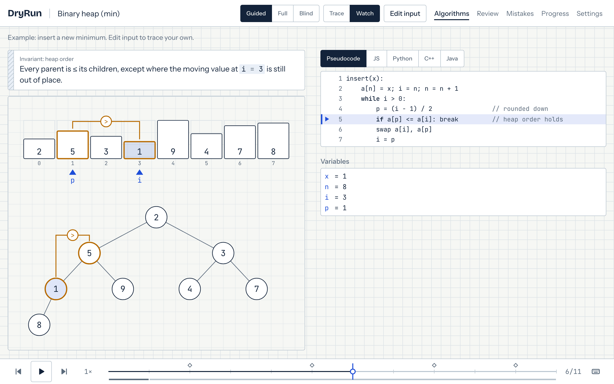
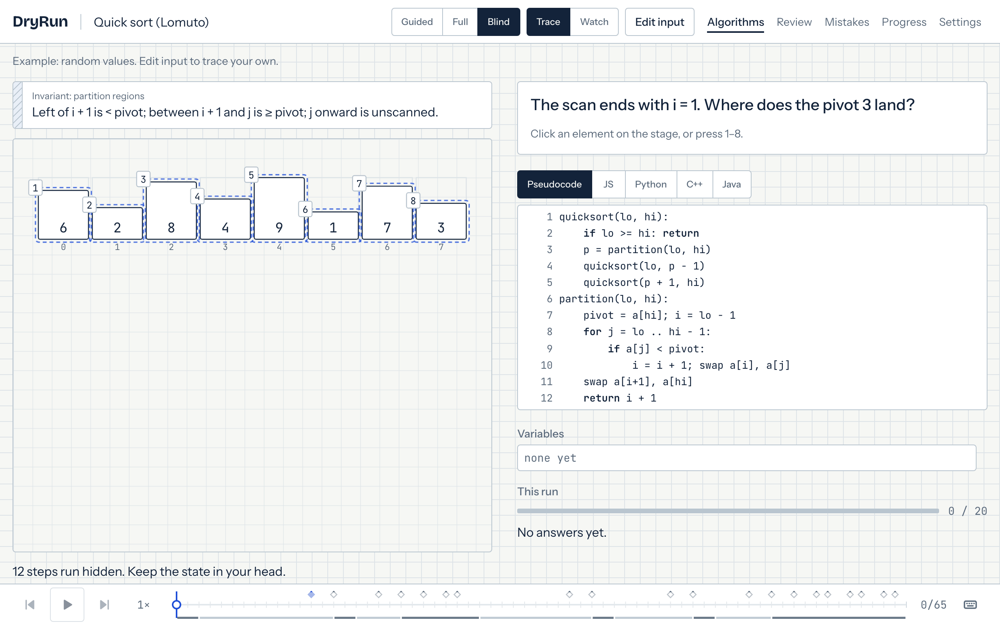
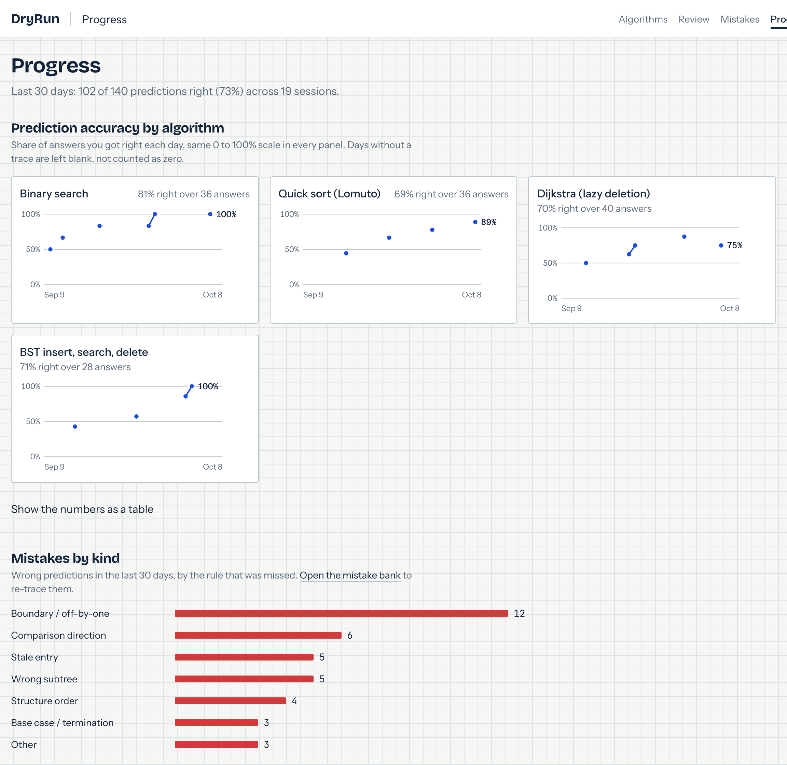
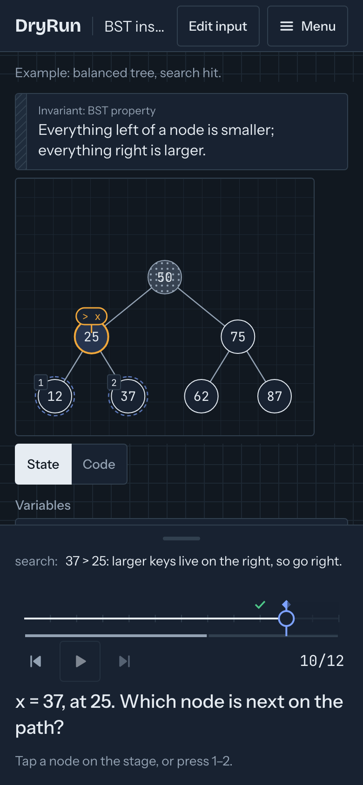
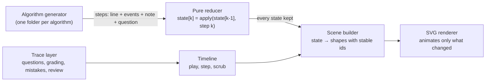

# DryRun

**Stop watching algorithms. Start tracing them.**

DryRun is a dry-run trainer for data structures and algorithms. You don't watch an
animation. You run the algorithm yourself: the trace stops before each move that
matters and asks what happens next. You answer on the array, tree or graph. Then the
real move plays. If your guess was wrong, it stays on screen as a ghost next to the
truth, with the one rule you broke.

**[Try it at algodryrun.vercel.app](https://algodryrun.vercel.app/)**. It's free,
there's no account, and your progress stays in your browser.

[](https://algodryrun.vercel.app/)
[](#run-it-locally)
[](#license)



## Why

- **Watching isn't knowing.** After a visualizer you can say what Dijkstra *is*, but
  you can't run it in your head without slipping on a stale entry or an off-by-one.
- **Interviews ask for dry runs.** "Walk me through this input" is a skill you build
  by doing it, and a video can't check your work.
- **You forget.** A trace you got right today is gone in two weeks unless it comes
  back, on an input you haven't seen.

## How it works

1. **Predict.** The trace pauses before a key move and asks one question. Where does
   `mid` land? Which entry pops next? What value goes in this cell? You answer by
   tapping the element, ordering a queue or typing a number.
2. **Reveal.** The real move plays, computed by the algorithm itself, never by hand.
3. **Learn the rule.** A wrong guess stays on screen as a red dashed ghost next to the
   truth, with one line that names the rule, such as *"lo moves to mid + 1, not two
   past mid."* The mistake is filed by kind: boundary, comparison, stale entry, wrong
   subtree and so on.
4. **Re-trace later.** The algorithm comes back after 1, 3, 7 and 21 days on a fresh
   seeded input. Each re-trace targets the kind of mistake you make most.

## Features

### Tracing


- **Ghost of the wrong guess**: your pick in red dashes, the truth ringed in blue, and the rule in one line.
- **Three levels**: Guided asks the key questions, Full asks every one, and Blind freezes the stage between questions.
- **Invariant lens**: the invariant is always on screen, filled in with live values ("inside [lo = 5, hi = 8]").
- **Exact timeline**: scrub to any step and back. Every state is stored, so nothing is approximate, and your right and wrong answers are marked on the timeline.
- **Real code beside the trace**: pseudocode, JavaScript, Python, C++ or Java, with the current line highlighted.
- **Honest internals**: Dijkstra strikes stale entries through before skipping them, and BST delete shows the successor copy instead of a magic swap.



*Linked views: the heap's array and its tree are the same elements, so a swap moves one value in both.*

![Dijkstra with the code panel set to C++: line 12, "dist[v] = dist[u] + w;", is highlighted while the narration says the old entry (4, 1) stays and will pop stale.](docs/readme/code.png)

*Every listing is mapped line by line to the pseudocode and run in tests against a reference implementation.*

### Blind mode



In Blind mode the stage freezes and the steps up to the next question run hidden.
You keep the state in your head, answer, and then watch the hidden steps replay.
It's the closest thing to tracing on paper.

### Learning loop



- **Mistake bank**: wrong answers grouped by kind, each with its rule, and a link that re-traces the exact input.
- **Practise a mistake**: build a new input that sets up the same catch.
- **Spaced re-traces**: due algorithms come back at 1, 3, 7 and 21 days on inputs you haven't seen.
- **One honest chart**: prediction accuracy per algorithm over 30 days, plus mistakes by kind. No XP, streaks or badges.

### Built for how you study



- **Works on phones**: the question sheet sits at the bottom, within thumb reach.
- **Keyboard first**: <kbd>Space</kbd> plays, <kbd>←</kbd> <kbd>→</kbd> step, <kbd>1</kbd>–<kbd>9</kbd> answer, <kbd>Enter</kbd> submits, <kbd>?</kbd> lists shortcuts.
- **Light and dark themes, and reduced motion**: every state has a colour *and* a shape cue.
- **Your own inputs**: edit any input, with validation and edge-case presets (empty array, duplicates, a stale pop, deleting the root).
- **Shareable links**: the algorithm, input and seed live in the URL, and a link always opens paused at step 0.
- **No account**: data stays in `localStorage`, and you can export and import it as JSON.

<br clear="right">

## Algorithms

13 algorithms, each with its own questions, mistake rules, edge-case presets and
random-input generator.

| Algorithm | Family | What you practise |
|---|---|---|
| Binary search (classic and lower bound) | Search | Where lo, mid and hi go, and when the loop ends. |
| Insertion sort | Sorting | Which element shifts into the gap, whether a[j] moves, and where the key lands. |
| Quick sort (Lomuto) | Sorting | Where i and j go, which side each element lands on, and where the pivot settles. |
| Merge sort (top-down) | Sorting | Which front is copied next, what is left over, and which call returns. |
| BST insert, search, delete | Trees | Which child comes next, which delete case applies, and who the successor is. |
| Binary heap (min): insert, extract-min, build-heap | Trees | Which child a value sifts towards, whether it keeps sifting, and where a parent sits. |
| Union-find (rank + path compression) | Trees | Which root a find reaches, where a compressed node points, and which root goes on top. |
| Breadth-first search | Graphs | Which node leaves the queue, what the queue holds after each discovery, and each dist. |
| Depth-first search | Graphs | Which node dfs visits next, each discovery and finish time, and when a call returns. |
| Dijkstra (lazy deletion) | Graphs | Which entry pops next, whether it is stale, and what the relaxed distance becomes. |
| Topological sort (Kahn) | Graphs | Which node is output next, what each in-degree drops to, and when a node may join the queue. |
| 0/1 knapsack | Dynamic programming | The value of each cell, which cell it reads besides the one above, and which items are taken. |
| Longest common subsequence | Dynamic programming | Whether the letters match, the value of each cell, which cell it reads, and the walk back. |

Every algorithm states its tie-break rule (for example, "smaller node id first"), so
each question has exactly one right answer.

## Tech

- **React 19** and **TypeScript** in strict mode, built with **Vite 8**
- **Tailwind CSS 4**, with design tokens in CSS and self-hosted fonts
- **Motion** for spring animation, loaded lazily so the landing page stays small
- **wouter** for routing
- **SVG renderer**: every layout (arrays, trees, forests, graphs, DP grids, recursion trees) is computed in the project, with no d3 and no dagre
- **No backend**: a static `dist/` folder that any static host can serve
- **Vitest**, **fast-check**, **Playwright** and **axe-core** for testing

### How it's built

Each algorithm is a plain generator that yields **semantic events**, such as
"compare these two", "move this element to slot 5" or "pop this queue entry". It
never touches animation. Everything visual is derived from those events:



- **Exact scrubbing.** All states are computed up front and kept, sharing unchanged
  parts. Step *k* is an array lookup, so going back never relies on an undo.
- **Stable ids.** Every element, node and edge keeps its id for the whole run. A
  swapped value moves across the screen. It never vanishes and reappears.
- **The questions come from the algorithm.** The answer and the likely wrong answers,
  each tagged with a mistake kind and a rule, are computed from the live state.
  Nothing is hand-tagged per input.
- **One folder per algorithm.** Adding an algorithm means adding a folder under
  `src/algorithms/<id>/` with its generator, pseudocode, code listings, invariant,
  questions, presets, input generator and tests. The engine has no
  algorithm-specific branches.
- **Seeded randomness.** Every random input comes from a seeded generator, and the
  seed lives in the URL.

The full design is in [`docs/ARCHITECTURE.md`](docs/ARCHITECTURE.md). The visual
language, called "graph paper", is described in [`docs/DESIGN.md`](docs/DESIGN.md).

## Quality

A wrong animation destroys trust, so correctness is tested at every layer:

- **Property tests**: every algorithm runs on 1,000 random inputs. The final state
  must match a plain reference implementation, the invariant must hold at every
  step, and every question must have exactly one correct answer.
- **Determinism**: playing forward, jumping to a step and scrubbing back give the
  same state.
- **Code listings are executed**: the JavaScript, Python, C++ and Java listings run
  on the presets plus hundreds of random inputs and are checked against the
  reference. Python, C++ and Java run when that toolchain is installed.
- **About 700 unit tests** with Vitest.
- **End-to-end tests** with Playwright at desktop and phone sizes: full traces, Blind
  mode, the code panel, the learning screens, and light and dark themes.
- **Accessibility**: axe checks on every route in both themes, a keyboard-only trace,
  visible focus, and tap targets of at least 44 px on phones.
- **Performance budgets**: p95 frame time of 20 ms or less at 390 px with CPU slowed
  ×6, LCP under 2.5 s and CLS under 0.1 on Fast 4G, and a gzipped JS budget for
  each route.

## Run it locally

You need **Node 20.19 or newer** (Vite 8 requires it).

```bash
git clone https://github.com/Mr-Ankitpandey/DryRun.git
cd DryRun
npm install

npm run dev          # dev server at http://localhost:5173
npm test             # unit and property tests (Vitest)
npm run typecheck    # tsc --noEmit
npm run lint         # ESLint
npm run build        # type-check and production build into dist/
npm run preview      # serve the production build
```

End-to-end tests need a Playwright browser the first time:

```bash
npx playwright install chromium
npm run e2e          # builds, serves on :4173 and runs the Playwright suite
```

### Project structure

```
src/
  algorithms/   one folder per algorithm, plus the registry and test harness
  engine/       events, reducer, timeline, scene builder, layouts (no React)
  render/       SVG views: arrays, trees, graphs, grids, panels
  trace/        questions, grading, mistake classification
  learn/        review scheduler, progress, targeted re-traces
  app/          route pages: landing, library, trace, review, mistakes, progress, settings
  ui/           design-system components and motion tokens
  lib/          seeded RNG, URL codec, versioned local storage
  styles/       colour and type tokens
e2e/            Playwright specs (flows, accessibility, performance)
docs/           plan, architecture, design and algorithm specs
```

## Roadmap

Planned, not built yet:

- **Trace your own code**: paste a JavaScript function, run it in a sandboxed worker,
  and trace it with the same renderer.
- **Break my code**: find the step where a buggy version first differs from the
  correct one, and replay both side by side.
- **Optional AI explanations** of where your code diverged, using your own API key.
  The rule for each mistake stays the default.
- **Python** tracing in the browser.

## License

No open-source license has been chosen yet. All rights reserved © Ankit Pandey.
To use the code beyond reading it, please open an issue first.
